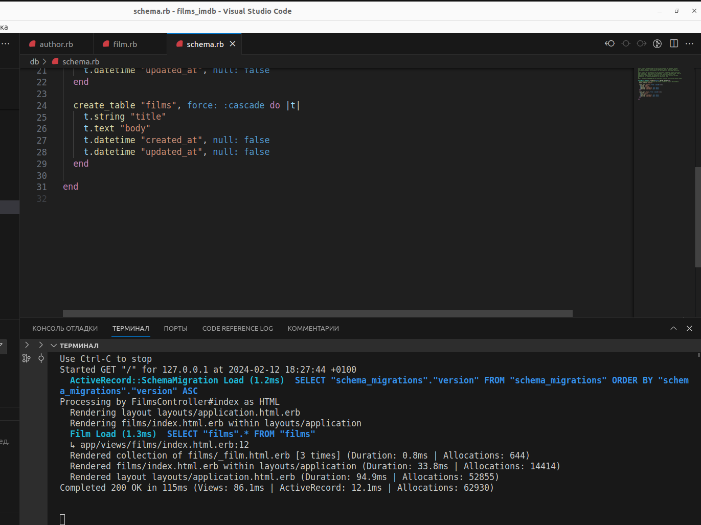
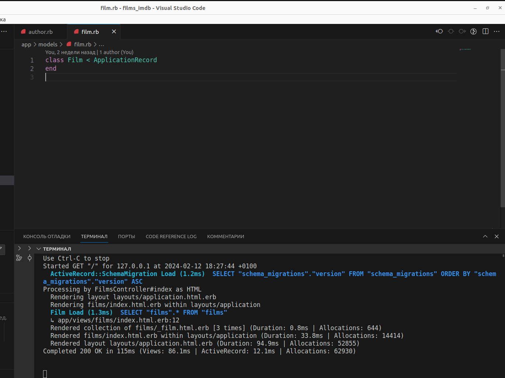
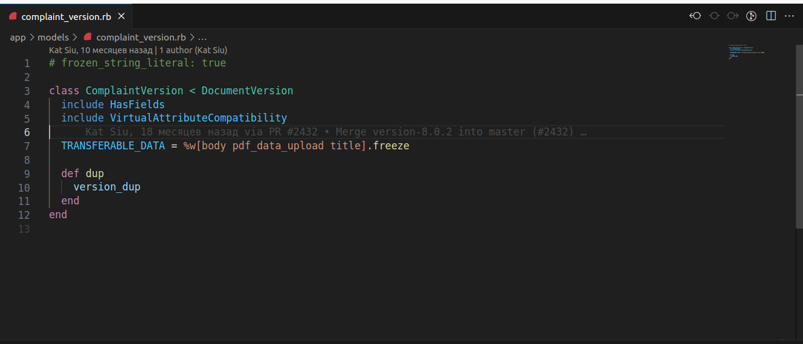
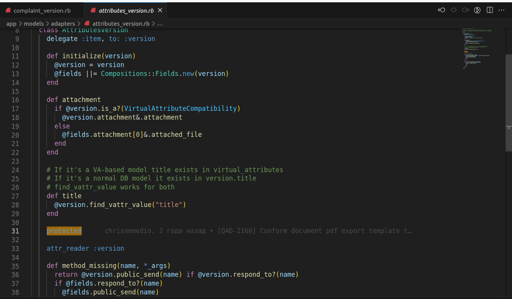

Example of abstraction:

Here we can see the creation of a simple structure representing a Film entity at the Model level, which is then transformed into database fields for the films table. 

Example of inheritance:

Here we can observe inheritance from the ApplicationRecord class, which allows the Film class to inherit all the methods needed for working with the database. In Rails, we use inheritance extensively.

Example of polymorphism:

Here we can see polymorphism demonstrated by including methods from the modules HasFields and VirtualAttributeCompatibility, which enable the ComplaintVersion to respond to these methods.

Example of polymorphism:

Here we can see polymorphism demonstrated by including methods from the modules HasFields and VirtualAttributeCompatibility, which enable the ComplaintVersion to respond to these methods.